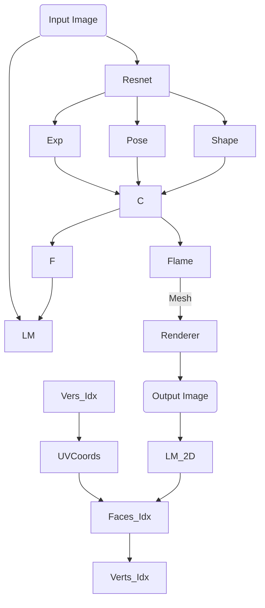
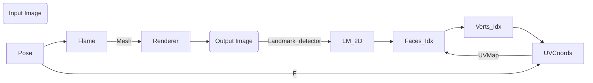

# markdown

- [cheat sheet pour markdown](https://github.com/adam-p/markdown-here/wiki/Markdown-Cheatsheet)

- [cheat sheet pour les formules]( https://jojozhuang.github.io/tutorial/mathjax-cheat-sheet-for-mathematical-notation/ )

# Chap 1
## Chap 2

xxxx
- ll
- kkk

  1 qqq
  
  1 ddd
  
  1
  

# Architecture

$x=y²$

## Rig Learning for correctives 

- $K_s$ : number of identity coefs
- $E_s$ : identity eigenvectors
- $K_e$ : number of blendshapes
- $E_e$ : blendshapes basis
- $K_c$ : number of correctives
- $E_c$ : correctives basis
- $T$ : number of frames
- $N$ : number of vertices
- $a_s : N \times 3$ : average model

$P =  a_s + E_s \Sigma_{s}\alpha + E_e \Sigma_{e}\delta  + E_c \tau $

the $\Sigma_{s}$ and $\Sigma_{e}$ are diagonal matrix contains the eigenvalue of the identity and scaling factor  ( both Identity in our implementation)

let $W = \begin{bmatrix} \delta \\ \Large{1}  \end{bmatrix} $
stacking $\delta$ with ones

W : $(K_e + 1) \times T$

we estimate X : $(3 \times K_c) \times (K_e + 1)$
 
$\hat{X} = argmin_X \Big\|{X W - \tau } \Big\|^2 + \lambda \Big\| X \Big\|^2$

$\hat{X} = \tau W^t ( W W^t + \lambda I)^{-1} $

$P =  a_s + E_s \alpha + E_e \delta  + E_c \tau $

$\sum_{i,1,3} i$

# Files

# Data

# landmarks
FAN

